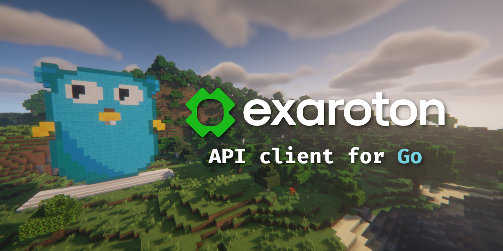

# Exaroton API client for Go

Manage your [Exaroton](https://exaroton.com/) Minecraft servers with ease with [Exaroton API](https://developers.exaroton.com/)!

This module only provides Exaroton API client for REST endpoints. Websocket communication is not yet supported.

Client was built according to [official OpenAPI specification](https://developers.exaroton.com/openapi.yaml).

## Usage

### Obtaining API key

API key is needed for authorizing requests. This token can be generated in [Exaroton account settings](https://exaroton.com/account/).

### Importing module

```sh
go get pkg.icikowski.pl/exaroton
```

### Creating a client

Exaroton API client can be created using `exaroton.NewClient` function. Following options are available:

| Option | Parameters | Description | Default value (if option not used) |
|-|-|-|-|
| `exaroton.WithBaseURL` | base API URL, `string` | Sets custom base URL for API calls. | `"https://api.exaroton.com/v1"` |
| `exaroton.WithHTTPClient` | `*http.Client` | Sets custom HTTP client for API calls. | `http.DefaultClient` |

### Using the client

For complete description of available methods, please consult the [`exaroton` Go docs](https://pkg.go.dev/pkg.icikowski.pl/exaroton) and [official API docs](https://developers.exaroton.com/).

```go
package main

import (
    "context"
    "fmt"

    "pkg.icikowski.pl/exaroton"
)

func main() {
    client, err := exaroton.NewClient(
        "your_token_here",
        // Can also specify options here:
        // exaroton.WithHTTPClient(http.DefaultClient),
        // exaroton.WithBaseURL("https://api.exaroton.com/v1"),
    )
    if err != nil {
        panic(err)
    }

    // Get account information
    account, _, err := client.GetAccount(context.Background())
    if err != nil {
        panic(err)
    }
    fmt.Println(account.Name)

    // Fetch all servers
    servers, _, err := client.GetServers(context.Background())
    if err != nil {
        panic(err)
    }

    for _, server := range servers {
        fmt.Println(server.Name)
    }

    // Get a specific server
    server := client.Server(servers[0].ID)
    serverInfo, _, err := server.GetServer(context.Background())
    if err != nil {
        panic(err)
    }
    fmt.Println(serverInfo.Motd)

    // Start the server
    _, err = server.Start(context.Background())
    if err != nil {
        panic(err)
    }

    // Get and set server RAM
    ram, _, err := server.GetRAM(context.Background())
    if err != nil {
        panic(err)
    }
    fmt.Printf("Server %s has %dGB of RAM\n", serverInfo.Address, ram)

    if ram < 8 {
        _, _, err := server.SetRAM(context.Background(), 8)
        if err != nil {
            panic(err)
        }
        fmt.Println("Server RAM increased to 8GB")
    }

    // Get server logs
    logs, _, err := server.GetLogs(context.Background())
    if err != nil {
        panic(err)
    }
    fmt.Println(logs)

    // Stop the server
    _, err = server.Stop(context.Background())
    if err != nil {
        panic(err)
    }
}
```
